# Using containers for parallel computation in R

Bioconductor Kubernetes Cluster that can be launched on demand on a cloud service (GKE or AKS).

## Software Requirements on local machine

1. Docker (https://docs.docker.com/get-docker/)

2. Kubernetes, specifically `kubectl` (https://kubernetes.io/docs/tasks/tools/)

3. Google Cloud SDK (https://cloud.google.com/sdk/docs/install)

4. Helm (https://helm.sh/docs/intro/install/)

5. Git

## Instructions

- **GKE** launch instructions are in [gke-helm-chart](./gke-helm-chart/README.md)

## Flowchart

```mermaid

flowchart TD
    id1["Start kubernetes cluster on GKE"] -->id2["Launch Bioc configuration with  ‘helm-chart’"] -->id3["Connect to Manager"] -->id4["Deploy R/Bioc code in parallel manner"] -->|"bplapply(X, FUN, BPPARAM = RedisParam())"|id5["Collect results"] -->id6["Clean-up cluster"]

```

## Maintainer

- Nitesh Turaga - nturaga.bioc at gmail dot com
